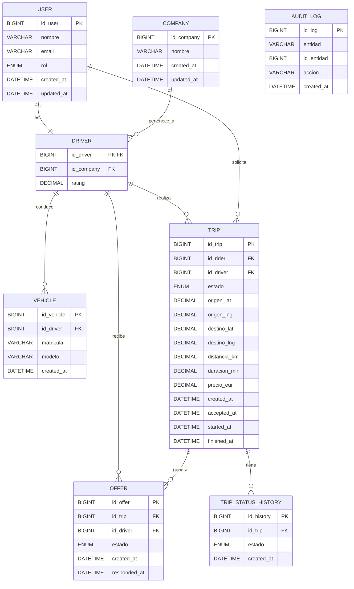

# Diseño de la Base de Datos - Ride Hailing

## 1. Introducción

Este md explica y muestra el diseño que se ha decidido para base de datos de la plataforma de ride-hailing.

En el sistema hemos decidido, tal y como se precisa en el enunciado, modelar las siguientes tablas:

* Usuarios (riders y conductores)
* Empresas
* Vehículos
* Viajes
* Sistema de ofertas
* Historial y auditoría

---

## 2. Modelo Entidad-Relación (MER)

A continuación se muestra el Modelo Entidad-Relación de la solución propuesta, el cual se ha programado en Mermaid:



---

## 3. Decisiones de diseño

En esta sección se irán describiendo cada una de las decisiones tomadas en el diseño de la base de datos, muchas de ellas con origen en el porpio enunciado de la práctica.

### 3.1 Separación de USER y DRIVER

Se ha decidido modelar `driver` como una extensión de `user` (relación 1:1).

**Motivación:**

* Evitar duplicidad de datos
* Permitir distintos roles, es decir, que un conductor pueda también ser usuario si lo precisa.
* Facilitar extensibilidad del sistema

---

### 3.2 Relación COMPANY → DRIVER (1:N)

Cada conductor pertenece a una empresa.

**Se han tomado las siguientes decisiones en el proceso:**

* FK en `driver`
* Se estavlecen como `ON DELETE RESTRICT`

Ambas son para evitar eliminar empresas con conductores activos

---

### 3.3 Modelo de viajes (`trip`)

La tabla `trip` la más extensa de todo el sistema.

Incluye:

* Geolocalización de origen y destino
* Estado del viaje
* Métricas (distancia, duración, precio)
* Timestamps del ciclo de vida

**Algunas decisiones clave tomadas:**

* `id_driver` es NULL hasta aceptación
* Campos como `accepted_at`, `started_at`, `finished_at` permiten hacer un análisis en el tiempo

---

### 3.4 Sistema de ofertas (`offer`)

Se modela como entidad independiente y representa cada oferta de un conc¡ductor a cada viaje propuesto por un usuario.

**Funciona tal que:**

* Un viaje genera múltiples ofertas
* Un conductor puede recibir múltiples ofertas

**Restricción clave:**

* Se definen como UNIQUE (id_trip, id_driver), d

El motivo es evitar duplicidad, e manera que no pueda haber varias ofertas de viaje repetidas; y controlar concurrencia.

---

### 3.5 Historial de estados (`trip_status_history`)

Entidad destinada a registrar la evolución del estado del viaje.

**Las principales motivaciones son:**

* Ofrecer trazabilidad sobre el paso entre estados de cada viaje
* Puede ayudar a sacar métricas temporales

**Diseño:**

* `trip.estado` representa el estado actual en el que esta el viaje
* Historial es una lista de todos los eventos pasados.

---

### 3.6 Auditoría (`audit_log`)

Tabla para registrar acciones sobre cualquier entidad del sistema. En esencia es un log de todo lo que ocurre, debe verse como un sistema de trazabilidad global.

**Sus posibles usos son:**

* Debugging
* Seguridad
* Trazabilidad técnica

Se ha decidido no relacionarla directamente en el MER, usando el patrón entidad + id_identidad. Esto permite auditar cualquier tabla sin cambiar el esquema, haciendolo totalmente flexible y sin necesidad de multiples claves foráneas.

---


### 4. Índices

Se han definido dos tipos de índices:

#### 4.1 Índices en claves foráneas

Las claves foráneas generan automáticamente índices en MySQL (InnoDB). No obstante, se han definido explícitamente para dar mayor claridad al sistema.

Incluyen:

- trip.id_rider
- trip.id_driver
- offer.id_trip
- offer.id_driver
- vehicle.id_driver
- driver.id_company

Estan pensados para optimizar JOINs entre tablas, haciendolos un poco más rápidos. Un ejemplo tipo:

```sql
SELECT *
FROM trip t
JOIN offer o ON t.id_trip = o.id_trip;
```

---

#### 4.2 Índices para consultas

Se han creado índices adicionales en columnas frecuentemente usadas en filtros:

- offer.estado
- trip(estado, created_at)
- trip_status_history(estado, created_at)


El motivo de esto es el de mejorar el rendimiento en consultas analíticas y dashboards, donde son muy comunes.

---

## 5. Métricas

Se ha decidido que las métricas del sistema no se almacenen directamente. El motivo es que se tratan de datos derivados, los cuales de calculan mediante consultas SQL. Hacerlos de esta manera puede evitar inconsistencias. Las metricas solicitidas y que se describirñan en queries son:

* Tasa de aceptación
* Tiempo medio
* Kilometraje medio
* Ingresos
* €/km y €/min

---

## 6. Concurrencia

El sistema requiere control de concurrencia, el cual aplica principalmente a la acción principal de la plataforma, siendo que un viaje solo puede ser aceptado por un único conductor. En caso de que no fuera así y un conductor A y otro B asceptaran al mismo tiempo, podría llevar a un bloqueo. 

Para solucionarlo, bloqueamos la fila, de forma que solo el primero que llega pueda aceptar el viaje, dejando al segundo y siguientes esperando.

Se implementará mediante lo que se conoce como "bloqueo pesismista":

  * `SELECT ... FOR UPDATE`

---

## 7. Conclusión

El diseño final separa varias de las áreas de funcionamiento de la base de datos:

* Modelo de negocio (trip, offer, driver)
* Historial (trip_status_history)
* Auditoría técnica (audit_log)

Esto permite una buena eslabilidad, mantenimiento y rendimiento, así como facilitar la capacidad analitíca a la hora de sacar los datos en Grafana.
